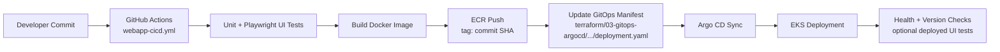

# Delivery Flow Diagram

```mermaid
flowchart LR
  DEV[Developer Commit] --> GH[GitHub Actions\nwebapp-cicd.yml]
  GH --> TEST[Unit + Playwright UI Tests]
  TEST --> BUILD[Build Docker Image]
  BUILD --> ECR[ECR Push\ntag: commit SHA]
  ECR --> GITOPS[Update GitOps Manifest\nterraform/03-gitops-argocd/.../deployment.yaml]
  GITOPS --> ARGO[Argo CD Sync]
  ARGO --> EKS[EKS Deployment]
  EKS --> VERIFY[Health + Version Checks\noptional deployed UI tests]
```
