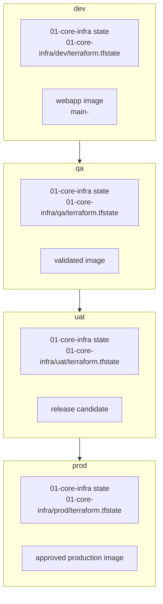

# Environment Topology Diagram

```mermaid
flowchart TB
  subgraph DEV[dev]
    DINF[01-core-infra state\n01-core-infra/dev/terraform.tfstate]
    DAPP[webapp image\nmain-<sha>]
  end

  subgraph QA[qa]
    QINF[01-core-infra state\n01-core-infra/qa/terraform.tfstate]
    QAPP[validated image]
  end

  subgraph UAT[uat]
    UINF[01-core-infra state\n01-core-infra/uat/terraform.tfstate]
    UAPP[release candidate]
  end

  subgraph PROD[prod]
    PINF[01-core-infra state\n01-core-infra/prod/terraform.tfstate]
    PAPP[approved production image]
  end

  DEV --> QA --> UAT --> PROD
```
