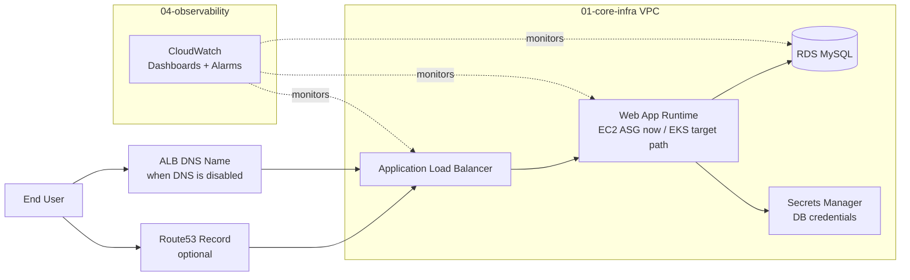

# System Context Diagram

```mermaid
flowchart LR
  U[End User] --> DNS[Route53 Record\noptional]
  U --> ALBDNS[ALB DNS Name\nwhen DNS is disabled]

  DNS --> ALB[Application Load Balancer]
  ALBDNS --> ALB

  subgraph VPC[01-core-infra VPC]
    ALB --> APP[Web App Runtime\nEC2 ASG now / EKS target path]
    APP --> RDS[(RDS MySQL)]
    APP --> SM[Secrets Manager\nDB credentials]
  end

  subgraph OBS[04-observability]
    CW[CloudWatch\nDashboards + Alarms]
  end

  CW -. monitors .-> ALB
  CW -. monitors .-> APP
  CW -. monitors .-> RDS
```
